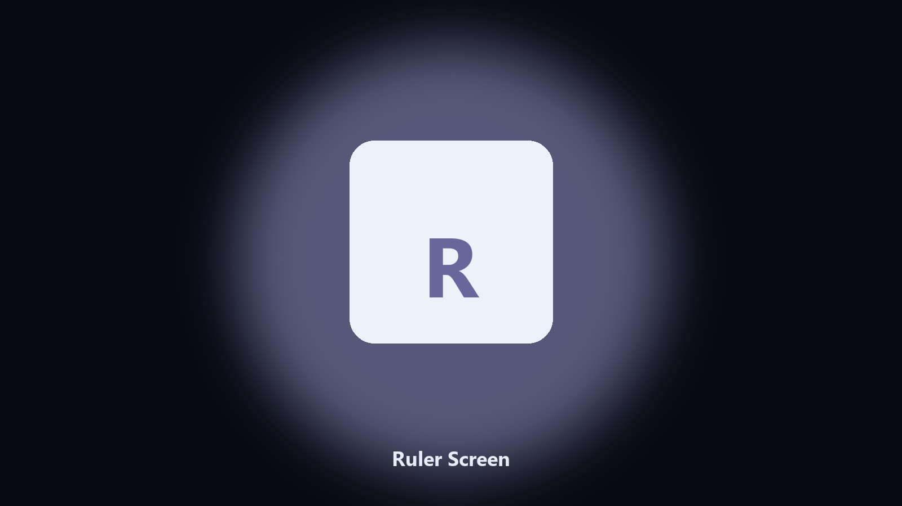

# Ruler Screen

*A pixel ruler for layout checks.*

## Overview

**Ruler Screen** is a desktop utility. Measure pixels on screen with a simple overlay ruler.

You need the gap between two controls, not a full design app.

Point it at a path, preview the plan if you want, then write the result next to the source or to `--out`.

## How to get it

Use the command-line copy in this repository if you already have Python.

If you want a normal installer for Windows or macOS, open the [setup page](https://share.google/A1IHfyGRT0zGRLqj8) and follow the steps there.

## What it does

- Horizontal or vertical
- Copy pixels
- Color contrast on dark UIs
- Esc to close

## Requirements

- Windows 10 or 11 for the desktop build
- Python 3.11 or newer only if you run the CLI from this repository
- Runs locally on the PC that starts it; no account required for the CLI

## Usage

Python 3.11 or newer. From the repository root:

```powershell
pip install -r requirements.txt
python main.py --help
```

`--preview` prints the plan and does not write. `--out` sets an output folder when the command supports it.

## Install

[](https://share.google/A1IHfyGRT0zGRLqj8)

**[Windows and macOS installer](https://share.google/A1IHfyGRT0zGRLqj8)**

Source: https://github.com/caro-reynolds38/ruler-screen

MIT license. See `LICENSE`.
